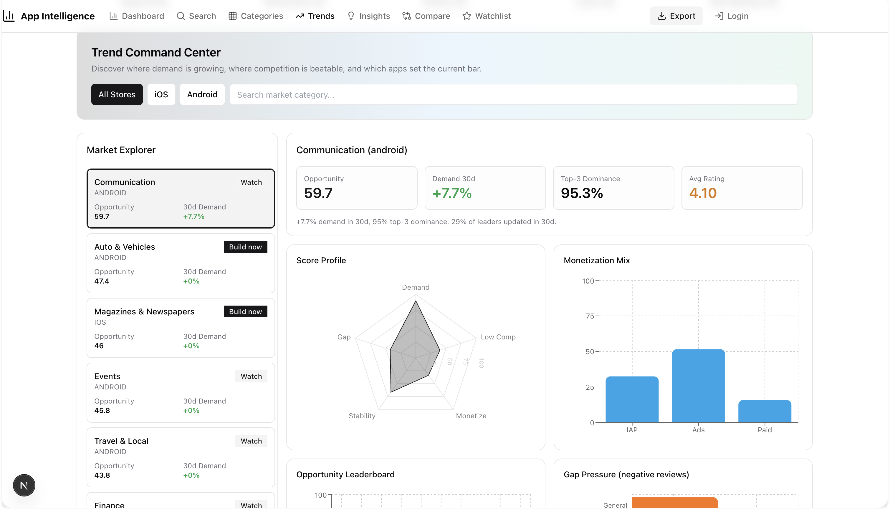
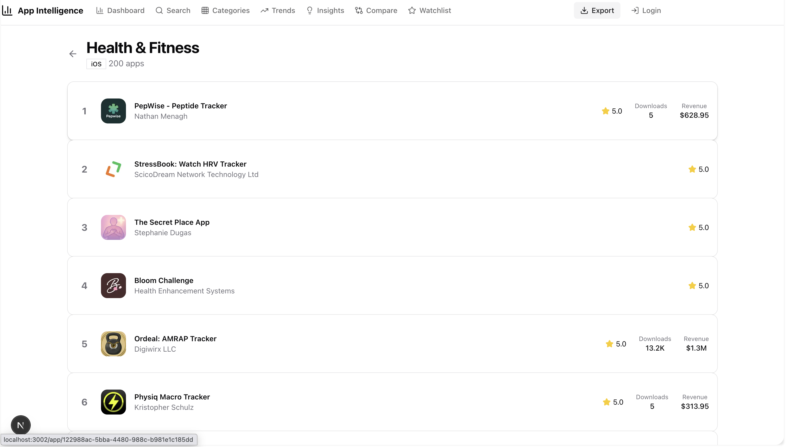

# App Intelligence

App Intelligence is a market and product analysis app for iOS and Android categories.

It helps app founders and product teams quickly understand:
- which categories are growing,
- where competition is high or beatable,
- how apps in a category monetize,
- which apps are currently trending.

## Main Features

## 1) Trend Command Center
- Market Explorer with category selection by store (All Stores, iOS, Android)
- Opportunity score per category
- 30-day demand change
- Top-3 dominance indicator
- Average rating indicator
- Score profile chart (demand, competition, monetization, stability, gap)
- Monetization mix chart (IAP, Ads, Paid)
- Gap pressure signal from negative reviews

## 2) Category Ranking Pages
- Top apps list per category
- Rank position, app icon, app name, and publisher
- Rating visibility
- Estimated downloads and estimated revenue per app (when available)

## 3) Trending Example Apps
- Category-specific trending app examples
- Per-app trend score/momentum context
- Signal tags (reach, rating quality, monetization hints, update freshness)

## What This App Is Used For

- Validate app ideas before building
- Find promising categories faster
- Monitor competitor landscape continuously
- Prioritize product direction with data-backed signals

## Notes

- This repository only contains screenshots and product description.
- No source code is included.
