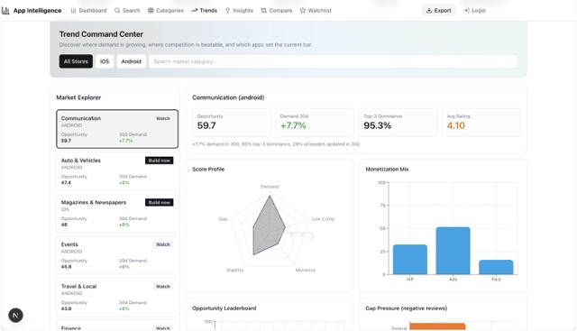
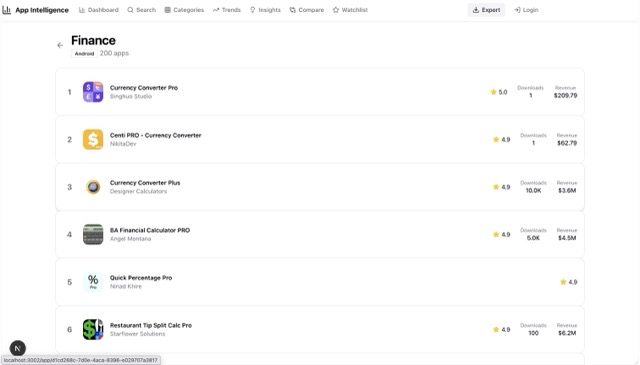
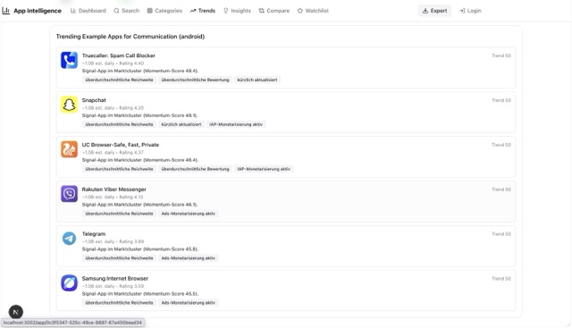

# App Intelligence — Product Portfolio Case Study

A portfolio showcase of **App Intelligence**, a market intelligence platform for app founders, product teams, and growth operators.

This repository is intentionally presentation-only: it contains product context and UI screenshots, with no application source code.

## Product Summary

**App Intelligence** helps teams discover where app demand is rising, where competition is beatable, and which category clusters offer the highest probability of success.

The product turns raw store signals into strategic decisions:
- Which market to enter next
- Which category to monitor vs. avoid
- Where monetization models are strongest
- Which trending apps reveal defensible product opportunities

## What The Product Solves

Most app teams face the same challenge: there is too much fragmented market data and too little decision clarity.

App Intelligence consolidates those signals into one decision layer:
- Category momentum and competition pressure
- Ranking quality and revenue/download proxies
- Trend-aware app examples per market cluster
- Action-oriented market exploration (build now, watch, avoid)

## Core Experience

### 1) Trend Command Center

A strategic dashboard for opportunity scoring, demand changes, competition intensity, and monetization patterns.

### 2) Category Ranking Intelligence (Finance)

Category-level ranking view with app positions, rating quality, and commercial proxy metrics.

### 3) Category Ranking Intelligence (Health & Fitness)

Vertical-specific ranking landscape for fast benchmarking and niche validation.

### 4) Trending Example Apps

Concrete trending app examples tied to selected market clusters, including signal tags and momentum context.

## Portfolio Positioning

This case study demonstrates product thinking across:
- Market intelligence UX
- Decision-support dashboard design
- Data storytelling for product strategy
- B2B SaaS framing for app ecosystem analytics

## Notes

- This repository is a **portfolio artifact**.
- It is designed for hiring conversations, product walkthroughs, and case-study review.
- No proprietary source code is included here.
